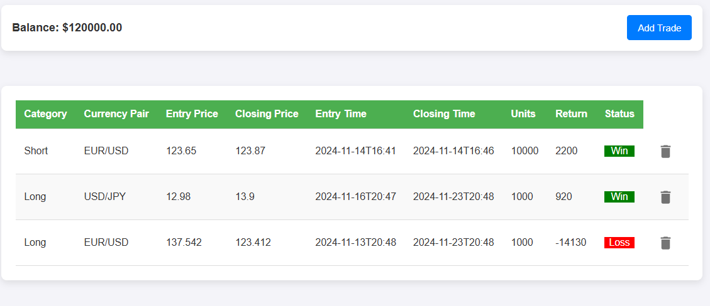

# Personal Trading Journal 📈

**Personal Trading Journal** is a microservice web application used to track trading performance and gain useful insights from trading transaction data.


## 🚀 Tech Stack

### Frontend


### Backend


## ✨ Features
- **📝 Trade Logging and Management**: Create, read, update, and delete (CRUD) your trading transactions.
- **📊 Portfolio Analytics**: Visualize your trading performance and portfolio balance.

## 📸 Preview


## ⚙️ Getting Started

Follow these instructions to get a copy of the project up and running on your local machine for development and testing purposes.

### Prerequisites

You will need the following installed on your machine:
- [Node.js](https://nodejs.org/) (v16.x or later)
- npm (Node Package Manager)

### Installation & Setup

1. **Clone the repository:**
   ```bash
   git clone https://github.com/your-username/Personal-Trading-Journal.git
   cd Personal-Trading-Journal
   ```

2. **Backend Setup:**
   Navigate to the backend directory, install the dependencies, and start the development server.
   ```bash
   cd backend
   npm install
   ```
   > **Note:** Ensure you configure your `.env` file in the `backend` directory with your Supabase credentials or other necessary environment variables before running the server.
   
   Start the Express server:
   ```bash
   npm run dev
   ```

3. **Frontend Setup:**
   Open a new terminal window, navigate to the frontend directory, and start the React app.
   ```bash
   cd frontend
   npm install
   npm start
   ```

The React frontend should now be running locally at `http://localhost:3000` and communicating with the backend API.

## 📂 Project Structure

```text
Personal-Trading-Journal/
├── backend/            # Express.js backend API
│   ├── src/            # Controllers, Repositories, Routes, Services
│   ├── package.json    # Backend dependencies
│   └── .env            # Backend environment variables
├── frontend/           # React frontend application
│   ├── public/         # Static assets
│   ├── src/            # React components, pages, and hooks
│   └── package.json    # Frontend dependencies
└── documentation/      # Documentation and assets (e.g., images)
```

## 📜 License

This project is licensed under the ISC License.
